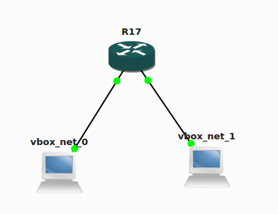

# Multicast project
This repository contains code and instructions for setting up a
fully functional environment for tests of multicast transport.

Main features of the setup:
* senders and receivers use Java's `MulticastSocket`,
* code tested on `CentOS 7`,
* network hardware simulated with `GNS3`,
* network hardware of `Cisco` type (router ...)

## Topology
In order to meaningfully reproduce basic complexities associated with
multicast we consider a setup involving two sub-nets with a router (R17)
in between.



The network `vbox_net_0` is a layer-2 network (supported by VirtualBox),
spanning `10.0.0.0/24`, to which the following elements are connected:
* CentOS box `Bot` (the *receiver*, 10.0.0.2),
* CentOS box `Top` (debug system, 10.0.0.1),
* interface `fa0/0` of `R17` (10.0.0.5).

The network `vbox_net_1` is an another layer-2 network (supported by VirtualBox),
spanning `20.0.0.0/24`, with the following elements connected:
* CentOS box `Side` (the *sender*, 20.0.0.2),
* CentOS box `Top` (debug system, 20.0.0.1),
* interface `fa0/1` of `R17` (20.0.0.5).

`R17` provides startic (unicast) routing between the two networks, while
`Top` (also with access to both networks) is for testing purposes only
(can act as a direct sender/receiver in each of the subnets).


## General multicast setup

If a network is to support multicast, two elements must be set up:
1. the IGMP querier system,
1. the PIM routing.


### IGMP
IGMP must be set up in each of the subnets. We use the router, `R17` as the
querier in each of the subnets. The following usually happens, or is supposed to happen,
in the IGMP system:
* the querier (e.g. a switch with IGMP-snooping or similar) mainains a list
of hosts interested in each of relevant multicast groups,
* this list is dynamic; each entry has expiry time (usually few seconds + 2 * query_interval),
* each host when opening a multicast socket sends (to `224.0.0.22`) a group join message;
the querier should action this message by creating a `(*,G)` entry for the originator of this message,
* the querier periodically (*query_interval*) asks (on `224.0.0.1`) the whole layer-2 domain for their
interest in the mc-groups; hosts with listening multicast
sockets are supposed to answer (on `224.0.0.22`) advertising their interest
in the mc groups,
* if the querier has valid `(*,G)` (or (`(S,G)` later on) entry for a mc-group `G` and host `H`, it will forward all inbound packets on the group `G` to the host `H`,
* if the querier does not hear from the host `H` for more than twice the *query_interval*, it will
deactivate the `(*,G)` record, and inbound multicast packets will not be forwarded to `H`,
* there are versions 2 and 3 of IGMP; some network hardware might not support the "3", and this will
be terminal to the mc-connectivity.


**Examples of IGMP traffic (tcpdump, CentOS 7)**
```
14:25:21.776909 IP 10.10.90.3 > 224.0.0.1: igmp query v2 [max resp time 10]
14:25:22.379882 IP 10.10.0.55 > 224.0.0.22: igmp v3 report, 1 group record(s)
```

### PIM routing
If multicast traffic is to travel successfully in domains larger than
single layer-2 domain, routing must be enabled. Without going
into [details of PIM-sparse routing](https://connections.swissbank.com/docs/DOC-104468)
let us state the following:
* for each group `G`, the querier must know the unique IP address of the
*Randezvous Point* (`RP`),
* on each new group of interest, the querier sends a group-join message to the `RP` (and builds
a tree of `(*,G)` records on all intermediate routers,
* in case of a sender sending a message on group `G`, the *first hop router* (i.e. the querier of its
layer-2 domain) wraps the first packet and sends it to the configured `RP` for the given group `G`; this creates
source-tree like entries on intermediate routers (todo: show example),
* the traffic can now flow via `source - first_hop_router - RP - querier - receiver`,
* if some (configurable) threshold for the volume of traffic is exceeded, a process is initiated, whereby the
routing information for a group `G` is converted to cover the shortest path between the source and the receiver.

Comparing the regular, unicast, routing with mc-routing we have:
* for unicast routing, each packet has a *destination IP*; the routing table determines
*uniquely* the next-hop router for a given *destination IP*,
* for multicast routing, each packet has a *source-group* `(S,G)` information, and the routing determines
all the next routers to which each packet should be copied and forwarded,
* similarly to dynamic unicast routing, mc-routing is subject to topology-changes depending on the traffic conditions.

**Example of (*,G) routing entry (Cisco)**

todo: show `(S,G)` entry, with RP set!

```
R1#sh ip mroute
	(*, 230.0.0.0), 00:05:22/00:02:58, RP 0.0.0.0, flags: SJC
	  Incoming interface: Null, RPF nbr 0.0.0.0
	  Outgoing interface list:
	    FastEthernet0/0, Forward/Sparse, 00:00:04/00:02:58
```


### Linux configuration
Assuming network layer (routers, switches) are properly configured,
and the sender/receiver applications are correct and running, the
success of the transport operations will depend on the configuration
of the operating systems of the sender/receiver. These do
interact with the network hardware, and must do so successfully.
The following features must be configured:

* receiver's host's firewall must allow a `udp` connection to the port where
 the mc-socket listens (in other words: there might be many sockets on the
 receiver's host listening to the given mc-group; only the ones bound to
 sockets on ports opened on the firewall will receive the traffic)
* the receiver's interface where the multicast traffic arrives must be multicast-enabled,
* the firewall on the relevant interface must allow `igmp` traffic, `firewall-cmd --zone=public --add-protocol=igmp`
* receiver must (in principle) be able to route packets back to the
  sender; this is the so-called `rp_filter`; and if the receiver cannot
  `ping` the sender, [packets will be dropped](https://serverfault.com/questions/163244/linux-kernel-not-passing-through-multicast-udp-packets)
* linux igmp version is reported in `/proc/net/igmp`; it should match the one used by network hardware


### Java sender/receiver
The content of the `multicast` package of the present repository contains
example `MSender.java` and `MReceiver.java` applications that
have been checked to work in the topology described here.

Few points of notice:
* both sender and receiver use the same class of socket (`MulticastSocket`),
* the receiver's socket is bound to port *and interface*,
* the receiver joins the group (`230.0.0.0`) before being able to receive traffic,
* the receiver leaves the group before closing the socket,
* the sender sets `TimeToLive` on its socket; without changing, the `TTL` might
be too low to allow communication (also a way to limit the reach of the multicast traffic,
* one can set the `sendBufferSize` for the sender and `receiveBufferSize` for the receiver;
  the receive buffer size has crucial effect on the ability to receive multicast traffic

### Multicast configuration for Cisco IOS
The following commands are used to configure multicast on a Cisco IOS machine.
Note, that the `config-if` commands must be repeated for each network
interface that should route multicast.

```
R1(config)#ip multicast-routing
R1(config-if)#ip pim sparse-mod
R1(config-if)#ip igmp version 3
R1(config)#ip pim rp-address 20.0.0.5
R1(config-if)# ip igmp query-interval 20		#auto-adjusts querier-timeout
```

### Linux multicast debug
The basic debug of inbound multicast-related traffic is provided by
`tcpdump -n -i [interface_name]`; additional info is provided by `-v` switch. Should
the content of packages also be logged, the `-X` switch applies.

Furthermore, it is important to understand that presence of *inbound* multicast packet
does not yet imply these packages will be delivered. They will first have to be processed
by the kernel (e.g. by the `rp_filter` module). A good measure of the success
of the receiving process is provided by the following rows of the `nstat` command:

```
a301-7775-0432.ldn.swissbank.com:mareckip] nstat
#kernel
IpInReceives                    3484               0.0
IpInDelivers                    3476               0.0
```

(in case of packets rejected for some reason, the `Delivers` will be far
less than `Receives`; note, the `nstat` command is incremental, and allows
to check changes between its invocations). Alternatively, the command `netstat -su` provides
a measure of the success of the `udp` operation:

```
a301-7775-0432.ldn.swissbank.com:mareckip] netstat -su
Udp:
    26651288834 packets received
    1299 packets to unknown port received.
    1414767 packet receive errors
    37216627 packets sent
    RcvbufErrors: 1457
```
It is to be expected, that the `packet receive errors` should be far
less than `packets received` (it should be noted, that packages
rejected by kernel will not be recorded in any of the above rows of `netstat`).


**Example of inbound multicast message**

**Example of trace of truning on receiver**

**Example of trace of turning on sender**


### Cisco IOS multicast debug

The following Cisco IOS commands (with example outputs)
help debg the state of multicast system of a Cisco switch:

**Check status of interfaces**
```
R1#sh ip int brief
	Interface                  IP-Address      OK? Method Status                Protocol
	FastEthernet0/0            10.0.0.5        YES manual up                    up
	FastEthernet0/1            20.0.0.5        YES manual up                    up
```

**Check multicast routing table**
```
R1#sh ip mroute
	(*, 230.0.0.0), 00:05:22/00:02:58, RP 0.0.0.0, flags: SJC
	  Incoming interface: Null, RPF nbr 0.0.0.0
	  Outgoing interface list:
	    FastEthernet0/0, Forward/Sparse, 00:00:04/00:02:58
```

**Check group registration information (igmp)**
```
R1#sh ip igmp groups
	Group Address    Interface                Uptime    Expires   Last Reporter   Group Accounted
	230.0.0.0        FastEthernet0/0          01:17:51  00:02:08  10.0.0.2
	224.0.1.40       FastEthernet0/0          15:51:32  00:02:17  10.0.0.6
```

**Check RandezvousPoint(s) for each mc-group**
```
R1#sh ip pim rp
	Group: 230.0.0.0, RP: 10.0.0.5, next RP-reachable in 00:00:08
	Group: 224.0.1.40, RP: 10.0.0.5, next RP-reachable in 00:00:08
```

**Full report on the interface, with igmp & routing**
```
R1#sh ip igmp int fa0/0
```

**Global multicast configuration**
```
R1#sh ip multicast
	  Multicast Routing: enabled
	  Multicast Multipath: disabled
	  Multicast Route limit: No limit
	  Multicast Fallback group mode: Sparse
	  Number of multicast boundaries configured with filter-autorp option: 0
```

**Enbale igmp debug (printed to console)**
```
R1#debug ip igmp
	*Aug  2 19:07:24.107: IGMP(0): v3 report on interface configured for v2, ignored
	(...)
```
